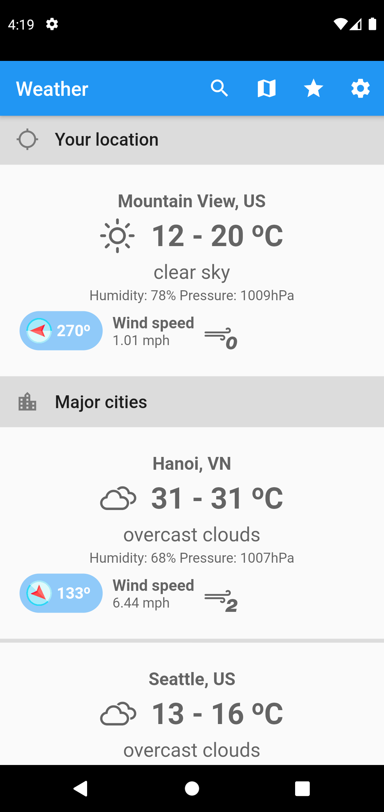
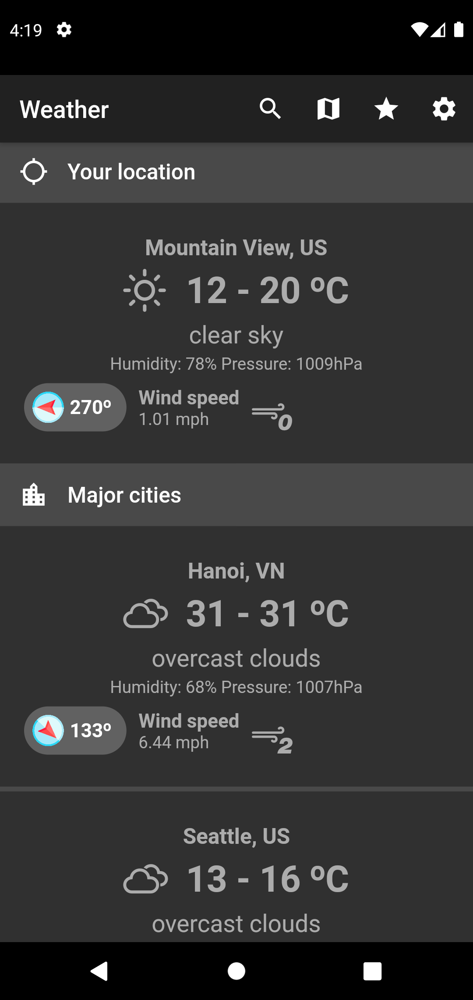
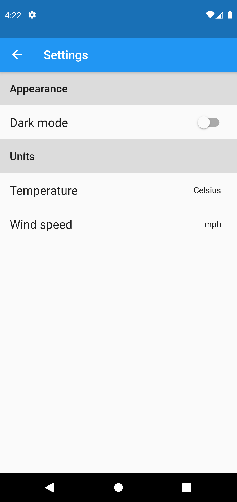
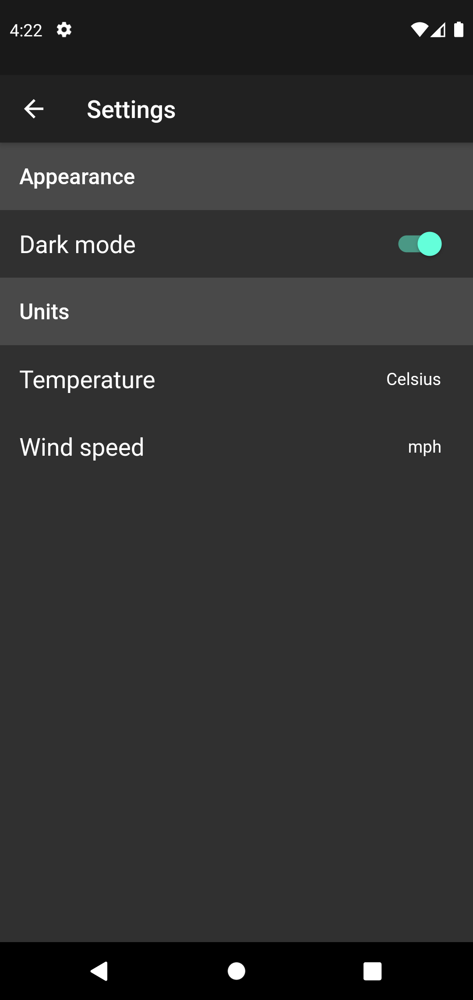
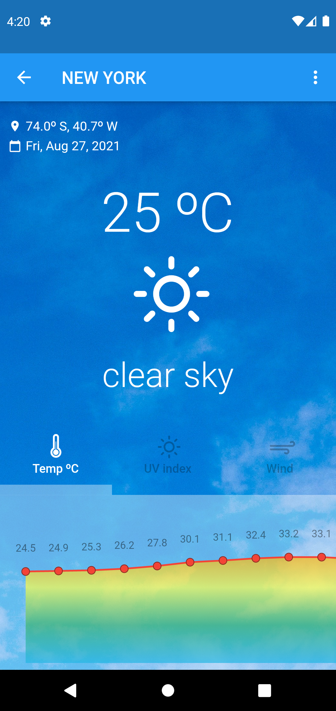
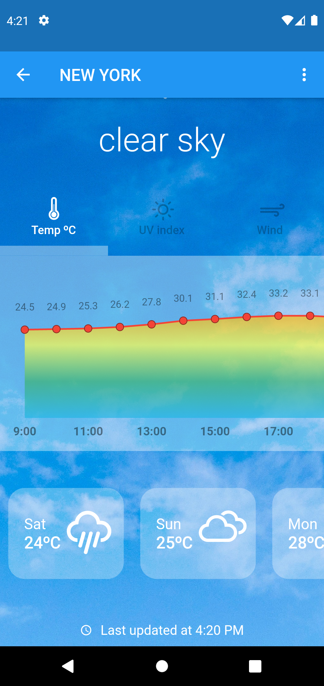
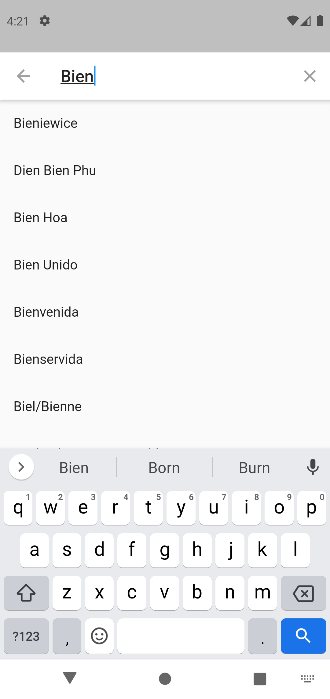
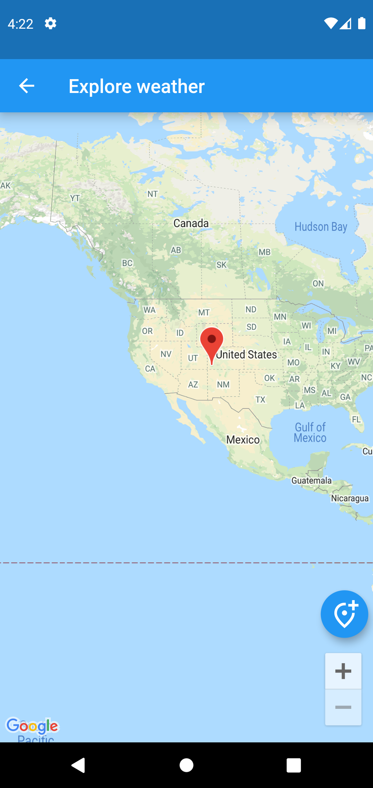
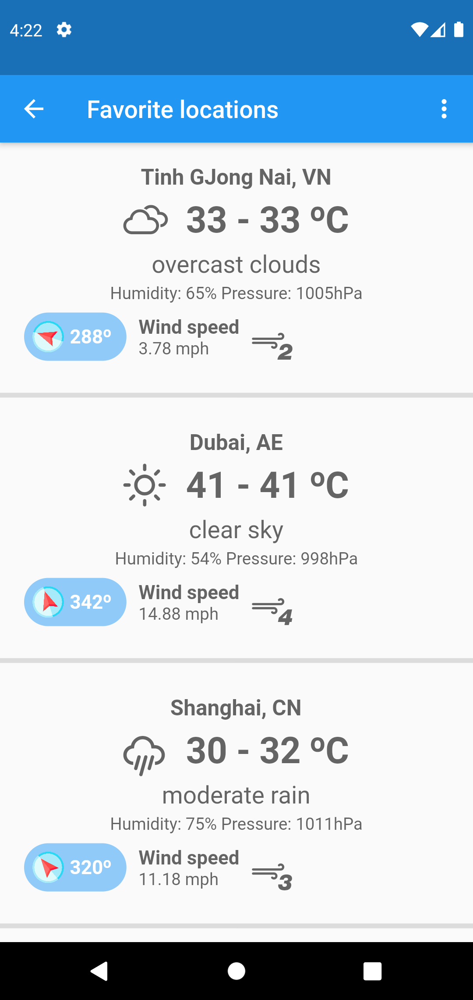

# Weather_app
A new Flutter project in which I learn how to work with api and learn many new UI features.

## Demo
- Home screen
  

    
     
  

- Setting screen (dark mode, unit of measurement)
  

    
     
  

- See weather of a city or a coordinate in detail
  

    
     
  

- Search page
  

     
  

- See weather anywhere in the world using map
  

     
  

- Save a collection of cities that your are interested in
  

     
  

## To do list
- [x] Start the weather object
- [x] Fetch API
- [x] Coordinate input
- [x] Bottom button bar
- [x] Option tabs for showing UV, temperature and wind graph
- [x] Swipe down to reload with 'RefreshIndicator'
- [x] Use BLoC to add favorite location, darkmode, setting
- [x] Setting: choose temperature unit
- [x] Setting: choose wind speed unit
- [x] Store recent search data
- [x] Improve search performance with 'Isolate'
- [x] Use images in DetailView to make app look better
- [x] Show weather at user's position on top
- [x] Parallax background in detail view
- [x] Smooth animation
- [x] Store favorite locations data
- [x] Delete search data
- [x] Drag and drop to reposition weather tile
- [x] Show bigger DragTarget when use long press on tile
- [ ] Save cities position after dragging
- [ ] Add or remove city in homepage
- [x] Snackbar (anounce that page is reloaded)
- [ ] Responsice design